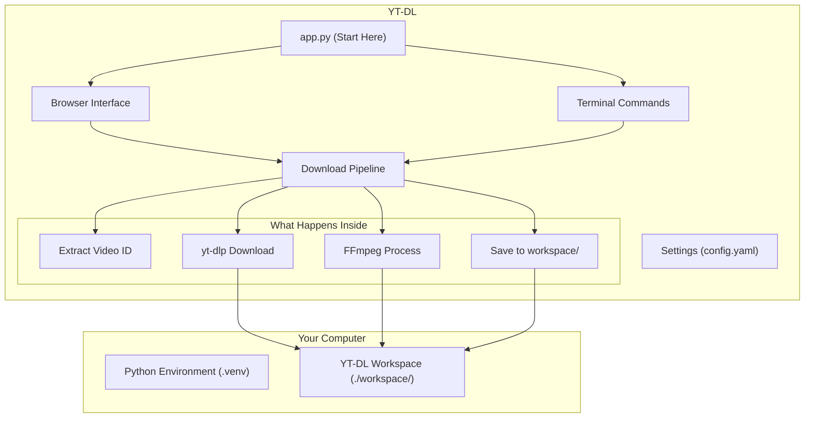

# ⬇️ YouTube Downloader (YT-DL)

**YT-DL** lets you download any public YouTube video as audio (MP3/AAC/OPUS) or video (MP4) at your preferred quality. Just paste a link and click Download — no technical knowledge needed.

It works on **Windows, macOS, Linux, and WSL2**, and is built to run well even on low-spec computers.

---

## ✨ What YT-DL Does For You

*   **📦 Self-contained — no extra software to install manually:** Auto-downloads everything it needs (video tools, JavaScript runtime) into its own folder on first run. Nothing installed system-wide.
*   **🎵 Audio or Video — your choice:** Download audio-only (MP3, AAC, OPUS) at 128K–320K, or full video (MP4) at 360p–1440p.
*   **🏷️ Automatic ID3 tags:** Audio downloads get title, artist, album, year, and cover art injected automatically. Metadata sourced from yt-dlp + online search (Spotify, MusicBrainz, iTunes, Last.fm).
*   **💻 Two ways to use it:** A browser-based interface or terminal commands.
*   **🧹 Automatic cleanup:** Hourly background purge deletes expired downloads. Manual cache controls available.
*   **⚡ Fast — downloads only what you need:** Audio mode skips the video stream entirely. Video mode uses best-quality source + stream copy (zero quality loss).
*   **📁 Portable workspace:** All downloads and tools live inside a single `workspace/` folder. Move it, back it up, or delete it — everything is self-contained.
*   **⚙️ One settings file:** All options in a single `config.yaml`.

---

## 🎬 How It Works

1. **Paste URL** — enter any public YouTube link
2. **Choose mode** — Audio (MP3/AAC/OPUS) or Video (MP4)
3. **Pick quality** — bitrate for audio, resolution for video
4. **Download** — yt-dlp handles the download, FFmpeg processes the output
5. **Auto-tag** — audio files get ID3 tags + cover art from yt-dlp + online search (configurable)
6. **Done** — file saved to `workspace/audios/` or `workspace/videos/`



---

## 📦 Storage & Automatic Cleanup

All files live inside `workspace/` in the project directory. Nothing is written outside of it.

| Folder | What's stored there |
|---|---|
| `workspace/bin/` | Video tools + JavaScript runtime (auto-downloaded on first run) |
| `workspace/audios/` | Processed audio files — `{VIDEO_ID}/{BITRATE}.{FORMAT}` |
| `workspace/videos/` | Processed video files — `{VIDEO_ID}/{RESOLUTION}.MP4` |
| `workspace/tmp/` | Download staging + Gradio temp (auto-cleaned) |
| `workspace/logs/` | Rotating application logs |

**Automatic cleanup:** Hourly background purge deletes expired audio/video by retention days. Temp files cleaned at startup, shutdown, and on-demand via "New Download." Adjust retention in `config.yaml`.

---

## 🚀 Getting Started

### What You Need

| Requirement | Version | Where to get it |
|---|---|---|
| **Python** | 3.11 or newer | [python.org/downloads](https://www.python.org/downloads/) |
| **Git** | Any | [git-scm.com](https://git-scm.com/downloads) |

---

## 🛠️ Installation

### Step 1 — Clone

```bash
git clone https://github.com/dimaskiddo/yt-dl.git
cd yt-dl
```

### Step 2 — Create Python Environment

```bash
python3 -m venv .venv
source .venv/bin/activate          # Linux/macOS/WSL2
# .venv\Scripts\activate.bat       # Windows CMD
# .venv\Scripts\Activate.ps1       # Windows PowerShell
```

### Step 3 — Install Packages

```bash
pip install --no-cache-dir -r requirements.txt
```

### Step 4 — Configure

```bash
cp config.yaml.example config.yaml
```

Everything works with defaults. Edit `config.yaml` to change download quality, retention, or server settings.

---

## 🐳 Docker

Pre-built image available at `dimaskiddo/yt-dl:latest`.

```bash
docker pull dimaskiddo/yt-dl:latest
```

**Run WebUI (default):**

```bash
docker run -d \
  --name yt-dl \
  -p 7860:7860 \
  -v "$(pwd)/workspace:/usr/app/workspace" \
  dimaskiddo/yt-dl:latest
```

**Run CLI commands:**

```bash
# Download audio
docker run --rm \
  -v "$(pwd)/workspace:/usr/app/workspace" \
  dimaskiddo/yt-dl:latest download "https://www.youtube.com/watch?v=<id>" -m audio

# Cache status
docker run --rm \
  -v "$(pwd)/workspace:/usr/app/workspace" \
  dimaskiddo/yt-dl:latest cache status
```

**Compose (recommended):**

```yaml
# docker-compose.yml
services:
  yt-dl:
    image: dimaskiddo/yt-dl:latest
    container_name: yt-dl
    ports:
      - "7860:7860"
    volumes:
      - ./workspace:/usr/app/workspace
    restart: unless-stopped
```

```bash
docker compose up -d
```

> **Note:** The `workspace` volume is persistent — all downloads, binaries, and logs survive container restarts. Open `http://127.0.0.1:7860` in your browser.

---

## 🕹️ How to Use YT-DL

### 🌐 Browser Interface

```bash
python app.py              # launches WebUI at http://127.0.0.1:7860
```

| Tab | What it does |
|---|---|
| **Downloader** | Paste URL, choose Audio/Video mode, pick quality, download |
| **About** | Project info and links |

> **WSL2:** open `http://127.0.0.1:7860` in your **Windows** browser.

### 💻 Terminal Commands

**Download:**
```bash
python app.py download "https://www.youtube.com/watch?v=<id>"
```

| Option | Description | Default |
|---|---|---|
| `--mode` / `-m` | `audio` or `video` | `audio` |
| `--audio-bitrate` / `-b` | Audio bitrate | `192K` |
| `--audio-format` / `-f` | Audio format (`mp3`, `aac`, `opus`) | `mp3` |
| `--video-resolution` / `-r` | Video resolution | `720p` |
| `--force` | Re-download even if cached | off |

**Other commands:**
```bash
python app.py cache status          # disk usage per folder
python app.py cache purge           # delete expired files
python app.py cache clean logs tmp  # force-delete files in directories
python app.py config                # print validated settings
```

---

## ✍️ Authors

*   **Dimas Restu Hidayanto** — [DimasKiddo on GitHub](https://github.com/dimaskiddo)

---

## 🏗️ Built With

*   [Python](https://www.python.org/) — programming language
*   [Gradio](https://gradio.app/) — browser interface
*   [yt-dlp](https://github.com/yt-dlp/yt-dlp) — YouTube video downloader
*   [FFmpeg](https://ffmpeg.org/) — audio/video processing
*   [Bun](https://bun.sh/) — JavaScript runtime for yt-dlp extractors
*   [Loguru](https://github.com/Delgan/loguru) — application logging
*   [Typer](https://typer.tiangolo.com/) — CLI framework
*   [Pydantic](https://docs.pydantic.dev/) — configuration validation
*   [mutagen](https://mutagen.readthedocs.io/) — ID3/MP4/Vorbis tag writing
*   [Pillow](https://python-pillow.org/) — cover image resize

---

## ⚠️ Disclaimer

Use at your own risk. YT-DL is provided as-is with no guarantees. The authors are not responsible for any issues arising from its use, including platform terms of service actions. Always review the terms of service of any platform you download content from.

---

## ⚖️ License

Distributed under the **MIT License**. See `LICENSE` for more information.

---

**YT-DL** — *Download YouTube audio and video, simple and clean.* ⬇️
