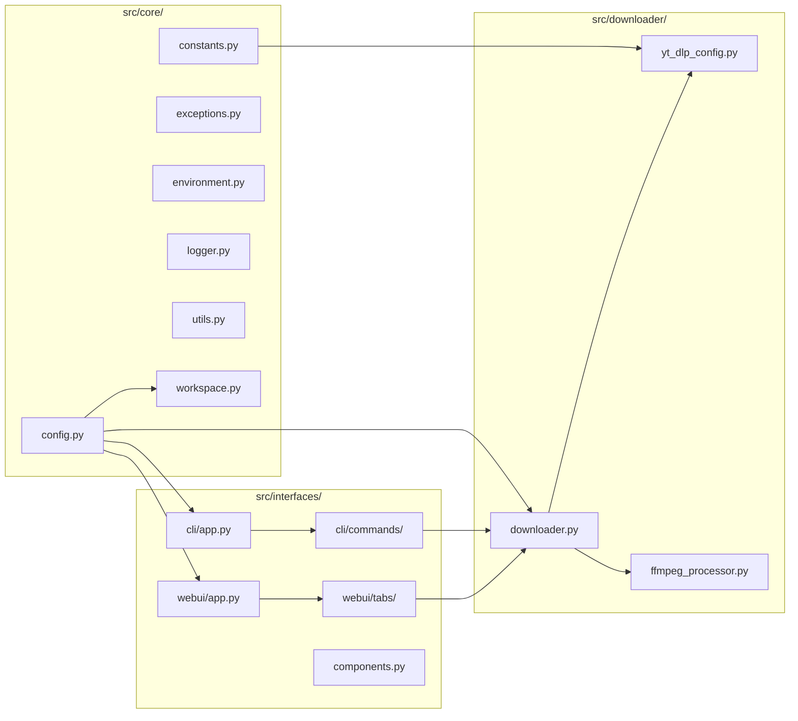
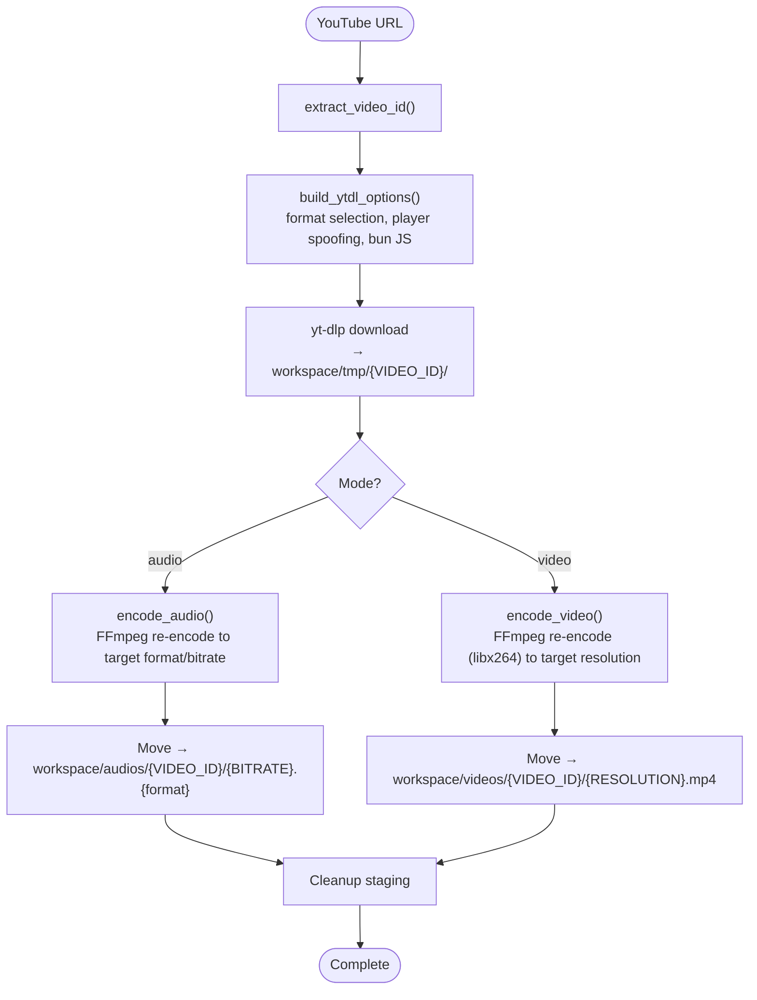
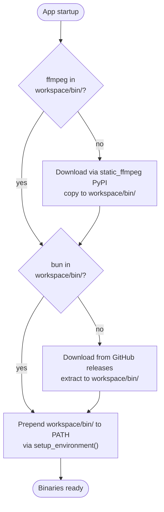
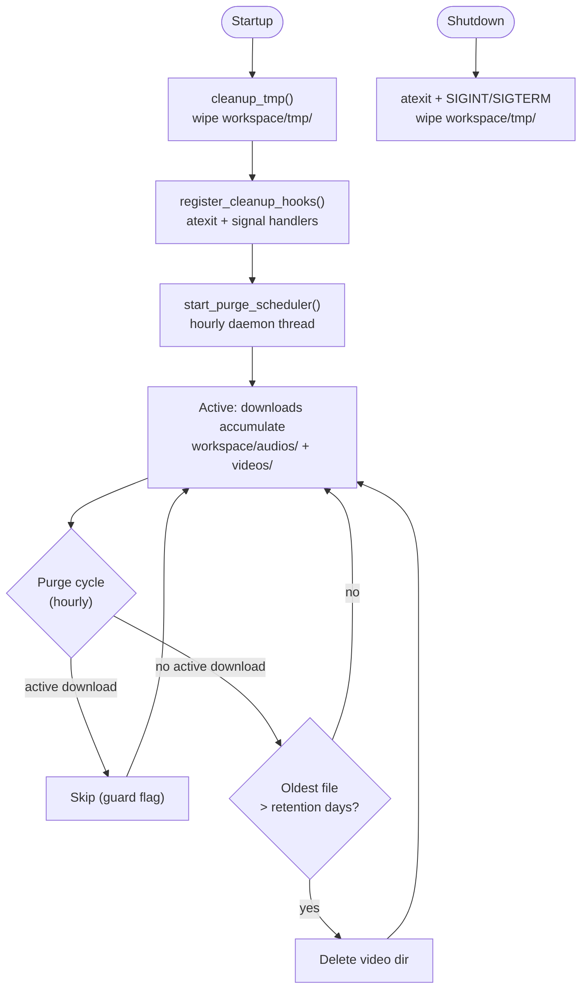

# YT-DL — Architecture

YouTube Downloader: download public YouTube videos as audio (MP3/AAC/OPUS) or video (MP4). CLI (`typer`) + WebUI (`gradio`), portable workspace, background task processing. **Defaults:** see `src/core/constants.py` — never guess numeric values.

---

## Module Map



---

## 1. Portable Asset Cache (`./workspace/`)

All runtime assets in `./workspace/`. OS temp dirs (`/tmp/`, `%TEMP%`) never used.

| Directory | Contents |
|---|---|
| `bin/` | FFmpeg + FFprobe, Bun JS runtime (auto-downloaded) |
| `audios/` | Processed audio — `{VIDEO_ID}/{BITRATE}.{format}` |
| `videos/` | Processed video — `{VIDEO_ID}/{RESOLUTION}.mp4` |
| `tmp/` | Download staging + Gradio temp files |
| `logs/` | Rotating loguru logs (`app.log`) |

**Boot:** `init_workspace()` creates all dirs. `ensure_ffmpeg()` + `ensure_bun()` download missing binaries. `setup_environment()` prepends `workspace/bin/` to PATH.

**Purge:** Hourly background thread via `start_purge_scheduler()`. Retention: `audio_days` / `video_days` / `tmp_days` from config (`0` = immediate, `-1` = skip). Protected: `bin/`, `logs/`. Guard: `ACTIVE_DOWNLOAD_EVENT` skips purge during active downloads.

---

## 2. Configuration

Single `config.yaml` at project root. Pydantic validated at startup. Full reference: `config.yaml.example`.

| Section | Owner | Purpose |
|---|---|---|
| `logging` | `src/core/logger.py` | Loguru level, rotation, file path |
| `server` | `src/core/config.py` | Gradio host, port |
| `downloader` | `src/downloader/downloader.py` | Mode, format, bitrate, resolution, retry |
| `workspace` | `src/core/workspace.py` | Workspace root path |
| `cleaner` | `src/core/workspace.py` | Purge scheduler + retention (audio/video/tmp days) |

**Singleton pattern:** `load_config()` loads YAML, validates via Pydantic, caches as module-level singleton. `get_config()` returns cached config. First run: copies `config.yaml.example` → `config.yaml`.

---

## 3. Download Pipeline



All downloads stage in `workspace/tmp/{VIDEO_ID}/` first. After processing, final output moves to `workspace/audios/` or `workspace/videos/`. Staging cleaned up after each download.

- **Audio:** Downloads `bestaudio` stream only (fast — no video). Re-encodes via FFmpeg to target format/bitrate. Supported: MP3 (`libmp3lame`), AAC (`aac`), OPUS (`libopus`). Default: 192K MP3.
- **Video:** Downloads `bestvideo+bestaudio`, yt-dlp merges automatically. FFmpeg re-encodes via libx264 with scale filter to target resolution. Resolutions: 360p, 480p, 720p, 1080p (default), 1440p. Format: MP4.

---

## 4. Binary Lifecycle



FFmpeg: downloaded via `static_ffmpeg` PyPI package. Bun: downloaded from GitHub releases (platform-specific zip). Both live in `workspace/bin/`.

---

## 5. Cache Lifecycle



Startup: wipe `workspace/tmp/` via `cleanup_tmp()`. Shutdown: `atexit` + signal handlers call `cleanup_tmp()`. Background scheduler: `run_purge_cycle()` runs hourly. Retention: `audio_days` / `video_days` / `tmp_days` (`0` = immediate, `-1` = skip). Protected: `bin/`, `logs/`. Guard: `ACTIVE_DOWNLOAD_EVENT` skips purge during active downloads.

---

## 6. Interfaces

**CLI** (`typer`): `src/interfaces/cli/app.py` orchestrates. Commands in `src/interfaces/cli/commands/` via `register(cli: typer.Typer)` — avoids circular imports.

| Command | Behaviour |
|---|---|
| `download <URL>` | Download and process (`--mode`, `--bitrate`, `--format`, `--resolution`, `--force`) |
| `config` | Print validated config |
| `cache status` | Per-dir disk usage |
| `cache purge` | Purge expired content |
| `cache clean` | Force-delete all files |
| `serve` | Launch WebUI |

**WebUI** (`gradio`): `src/interfaces/webui/app.py` orchestrates. Tabs built by `src/interfaces/webui/tabs/` (`build_downloader_tab`, `build_about_tab`).

**Routing** (`app.py`): CLI args → Typer; bare → Gradio. Always `.queue().launch()`.

---

## 7. Error Handling

Custom exception hierarchy in `src/core/exceptions.py`:

```
YTDownloaderError
  ├── ConfigValidationError    (config.yaml invalid/missing)
  ├── DownloadError            (yt-dlp or processing failure)
  ├── FFmpegError              (FFmpeg encoding failure)
  └── InvalidURLError          (YouTube URL unparseable)
```

No bare `except:`. Chain with `raise X from Y`.

---

## Key Design Decisions

1. **No `print()`** — all output via `loguru`
2. **No cookies / WSL detection** — public videos only
3. **Audio downloads `bestaudio`** — no video stream, faster download
4. **Staging flow** — all downloads go to `workspace/tmp/` before moving to final output
5. **Bun JS bundled** — required by some yt-dlp extractors
6. **`pathlib.Path` only** — no `os.path` or string concat
7. **Pydantic everywhere** — config, requests, results validated at boundaries
8. **Lazy `yt_dlp` import** — imported inside execution function, not at module level
9. **`subprocess` list form** — no `shell=True`, capture stderr, set timeout
10. **Config is defaults** — `config.yaml` provides starting values loaded at startup. Dropdowns in WebUI reflect config defaults.
