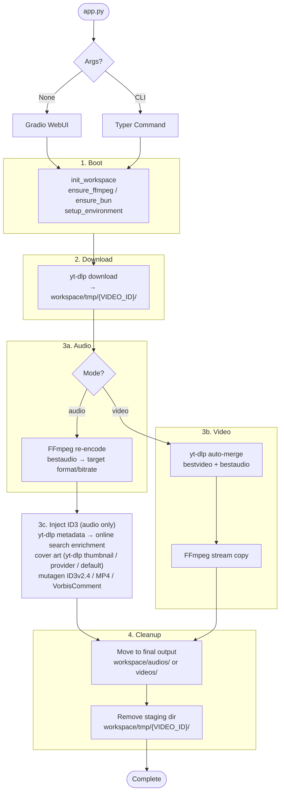
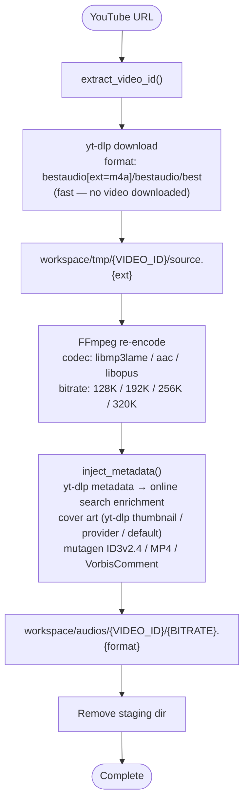
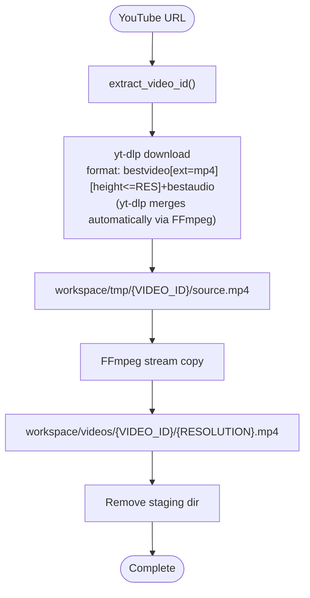
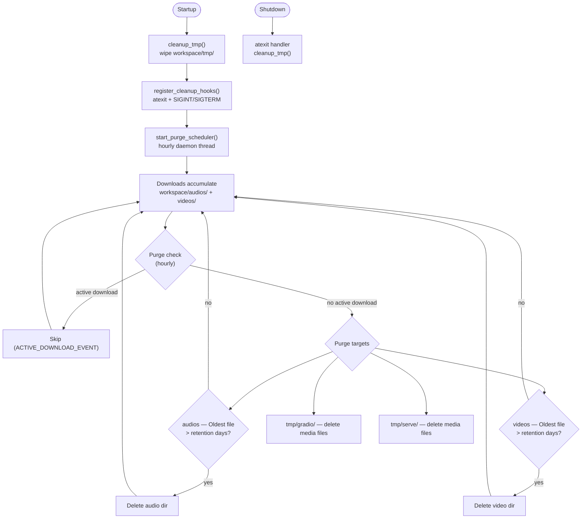
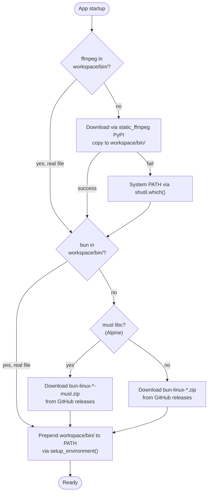
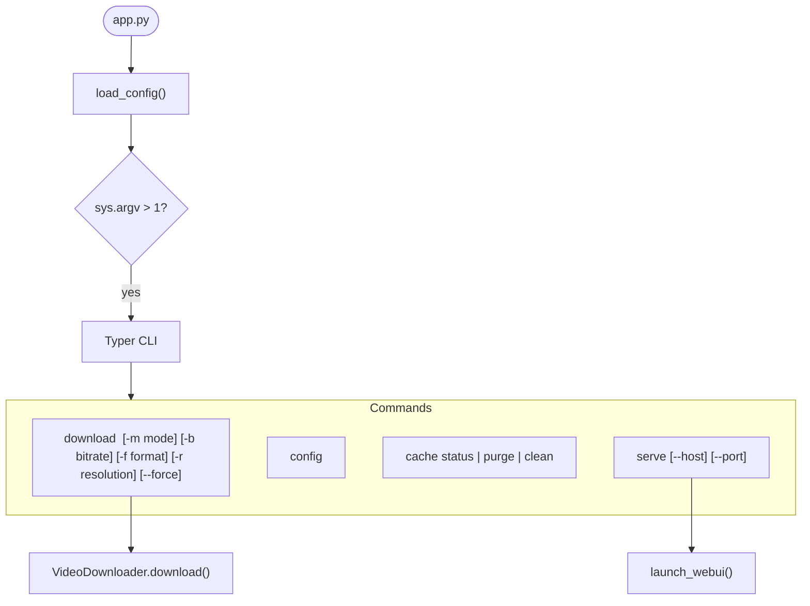
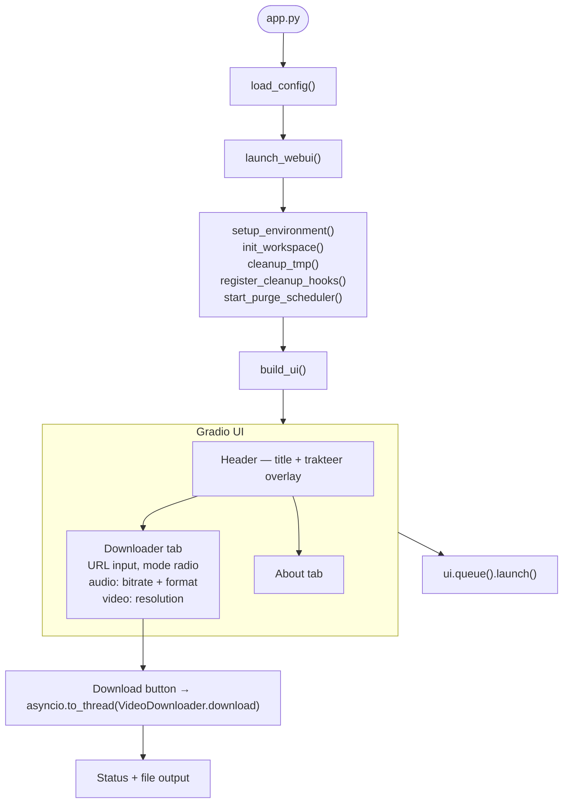

# YT-DL — Workflows

Step-by-step data flow: YouTube URL → audio or video file.

---

## Pipeline Overview

---

## Stage Details

### 1. Boot (`src/core/workspace.py`)

- Create missing `workspace/` dirs via `init_workspace()`.
- Auto-download FFmpeg (via `static_ffmpeg` PyPI). Falls back to system PATH via `shutil.which()`.
- Auto-download Bun from GitHub releases (platform-specific zip). Auto-detects musl libc on Alpine — downloads `-musl` variant.
- Inject `workspace/bin` into PATH via `setup_environment()`.
- Register cleanup hooks (`atexit` + signal handlers) and hourly purge scheduler.

### 2. Download (`src/downloader/downloader.py`, `src/downloader/yt_dlp_config.py`)

- Extract video ID from URL via `extract_video_id()`.
- Build yt-dlp options via `build_ytdl_options()` — format selection, player client spoofing, bun JS runtime.
- Download with retry (exponential backoff, transient error classification).
- Source file lands in `workspace/tmp/{VIDEO_ID}/`.
- `ACTIVE_DOWNLOAD_EVENT` set during entire download+process cycle — blocks purge scheduler.

**Audio mode:** `bestaudio[ext=m4a]/bestaudio/best` — downloads audio stream only, no video. Fast.

**Video mode:** `bestvideo[ext=mp4][vcodec^=avc][height<=RES]+bestaudio[ext=m4a]/...` — downloads best video+audio, yt-dlp merges automatically via FFmpeg at `ffmpeg_location`.

### 3. Process (`src/downloader/downloader.py`, `src/downloader/ffmpeg_processor.py`)

**Audio:**
- FFmpeg re-encodes bestaudio to target format/bitrate.
- Codecs: MP3 (`libmp3lame`), AAC (`aac`), OPUS (`libopus`).
- Bitrates: 128K, 192K (default), 256K, 320K.

**Video:**
- yt-dlp merges video+audio. FFmpeg stream copies (zero quality loss, near-zero CPU).
- Resolutions: 360p, 480p, 720p (default), 1080p, 1440p.

**Output verification:**
- After FFmpeg completes, output file existence is verified on disk.
- `_finalize_output` raises `DownloadError` if processed output not found in staging — prevents silent retry loops.

### 4. Output & Cleanup

- Final output moved/copied from staging to `workspace/audios/` or `workspace/videos/`.
- Staging directory `workspace/tmp/{VIDEO_ID}/` removed.

---

## Audio Pipeline

---

## Video Pipeline

---

## Staging Flow

All downloads use `workspace/tmp/{VIDEO_ID}/` as staging:

1. yt-dlp writes source to staging.
2. FFmpeg processes in staging (audio re-encode).
3. Final output moved/copied from staging to `workspace/audios/` or `workspace/videos/`.
4. Staging directory cleaned up.

---

## Cache Lifecycle

Retention: `audio_days` / `video_days` / `tmp_days` from `config.yaml` (`0` = immediate, `-1` = skip). Purge targets: `audios/` and `videos/` (by age), `tmp/gradio/` and `tmp/serve/` (by age). Staging dirs (`tmp/{VIDEO_ID}/`) are never purged. Protected dirs (never purged): `bin/`, `logs/`.

---

## Binary Lifecycle

---

## CLI Workflow

---

## WebUI Workflow

---

## File Naming Conventions

| File | Location | Pattern |
|---|---|---|
| Audio output | `audios/` | `{VIDEO_ID_UPPERCASE}/{BITRATE}.{format}` |
| Video output | `videos/` | `{VIDEO_ID_UPPERCASE}/{RESOLUTION}.mp4` |
| Staging source | `tmp/` | `{VIDEO_ID}/source.{ext}` |
| App logs | `logs/` | `app.log` |
